# CS506 Project Proposal

### Members:
* Anna LaPrade - U14515609 - alaprade@bu.edu
* Saniya Sekhon - U68321677 - saneya52@bu.edu 
* Sorathorn Thongpitukthavorn - U01165313 - plum@bu.edu
* Aline Mukadi - U43727980 - alemuk@bu.edu
  

---

### Description

Air quality plays a critical role in public health, especially for vulnerable groups such as children, the elderly, and people with asthma. The goal of this project is to build a machine learning pipeline that predicts the daily air quality category in Boston (e.g., Good, Moderate, Unhealthy) using weather and allergen (e.g., tree, grass, weed pollen) data. The project will cover the full data science lifecycle, including data collection, cleaning, feature extraction, visualization, and model training.

Our approach has two components:
1. Predicting AQI and allergen levels for a given day of the year to capture broad seasonal patterns.
2. Incorporating weather data from the previous three days to improve short-term forecasts.

Since AQI and pollen are influenced both by cyclical seasonal trends and immediate weather conditions, this dual approach allows us to model long-term patterns while also accounting for short-term variability.
  

---

### Clear Goals

* Predict the daily pollen count (tree, grass, weed) and AQI with a mean absolute error (MAE) of less than 10% of the observed range, or achieve an R² score of at least 0.75 on the test set.
* Demonstrate a statistically significant relationship (p < 0.05) between specific weather variables and allergen/air quality levels.
* Develop visualizations that highlight trends, seasonal cycles, and allergen intensity for public health stakeholders.
  

---

### Data Collection

The project will collect a comprehensive dataset by integrating data from several sources.

#### **Data Sources**
* **Weather Data:** Daily weather variables from the **Open-Meteo API**, including temperature (max, min, avg), humidity, wind speed/direction, precipitation, and atmospheric pressure.
* **Allergen and Air Quality Data:** Daily pollen counts and AQI from the **AirNow API**, including pollutants (e.g., PM2.5).
* **Lagged and Time-Based Features:** Data from the **three previous days ($t-1$, $t-2$, $t-3$)** will be included as predictors. Features for the day of the year and month will capture seasonality.

#### **Data Alignment Strategy**
To ensure spatial and temporal consistency across data sources:
- **Primary Location:** All data will be anchored to the **Downtown Boston AirNow monitoring station** (lat: 42.3601°N, lon: -71.0589°W).
- **Weather Data:** Open-Meteo API will be queried using the exact coordinates of the AirNow station. Open-Meteo interpolates data from nearby weather stations, ensuring accurate local conditions.
- **AQI Data:** Collected directly from the Downtown Boston AirNow station via the AirNow API.
- **Pollen Data:** We will use Ambee API, which provides pollen estimates for our exact coordinates, ensuring alignment with the reference point.
- **Acceptable Distance Threshold:** All data sources will be within a **10-mile radius** of the reference point. For pollen, we acknowledge that counts represent regional conditions, which is appropriate given pollen dispersion patterns.
- **Temporal Alignment:** All data will be aggregated to **daily values**, with timestamps aligned to noon Eastern Time for consistency.
  

---

### Modeling
We will develop two prediction models:

1. **Pollen Prediction Model:**
   - **Task:** Multi-output regression predicting continuous pollen counts for tree, grass, and weed allergens.
   - **Algorithms:** Linear Regression (baseline), Random Forest Regressor, and XGBoost Regressor.
   - **Evaluation Metrics:** RMSE, MAE, and R² on continuous predictions.

2. **AQI Prediction Model:**
   - **Task:** Regression predicting continuous AQI values, followed by categorization into EPA standard categories (Good/Moderate/Unhealthy/etc.).
   - **Algorithms:** 
      - Linear Regression: as a baseline to observe relationships between variables
      - Random Forest Regressor: less prone to over-fitting, less affected by hyperparameterization
      - XGBoost Regressor: Generally considered to have higher performance, although could be too complex
   - **Evaluation Metrics:**
     - Regression: RMSE, MAE, and R² on continuous AQI values.
     - Classification: Accuracy, F1-score, and Confusion Matrix on categorized AQI predictions.

The models will use the following general form:

$Y_t = \beta_0 + \beta_1 X_{1,t} + \beta_2 X_{2,t-1} + \beta_3 X_{3,t-2} + ... + \epsilon$

Where:
* $Y_t$ is the allergen count or AQI on day $t$.
* $X$ are the various weather and air quality features, including lagged data from previous days.
  

---

### Data Visualization
Visualization will be crucial for exploratory data analysis and communicating findings:
* **Correlation Heatmaps:** To reveal relationships between weather features and target variables.
* **Time Series Line Plots:** To show long-term trends and spikes in AQI and allergen data. Dual-axis plots will compare weather variables to AQI/allergen counts.
* **Scatter Plots with Regression Lines:** To visualize pairwise relationships and assess linearity assumptions.
* **Feature Importance Bar Charts (XGBoost):** To highlight features with the strongest influence on predictions.
  
---

### Test Plan
The project will use an **out-of-sample forecasting** test plan:
* **Training Data:** All collected data up to the end of 2024.
* **Testing Data:** All data collected from **2025 onward** to evaluate performance on untrained data.
* **Benchmarking:** Models will be compared using **5-fold cross-validation** on the training set and final evaluation on the 2025 test set.
  

---
  
# Preliminary Data Analysis 

---

## Correlation Analysis - Heatmaps

### Normal Data

To observe any possible linear relationships, Pearson correlation matrices were computed and displayed in a heat map for easy viewing. 

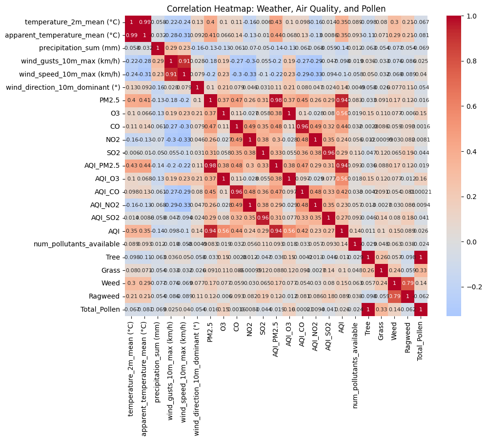

Strangely, these did not appear to show many strong linear relationships from weather to AQI. To visualize what strong relationships were, we filtered by correlations > abs(0.4).

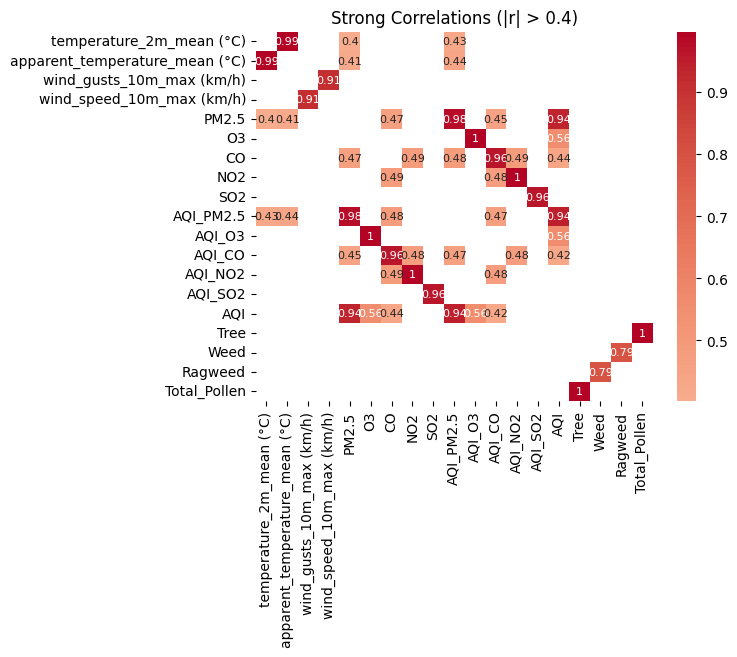

### Lagged Data
Then, we tried the same method with data lagged from multiple days (taking account the average over the last 1, 2, 3 days)

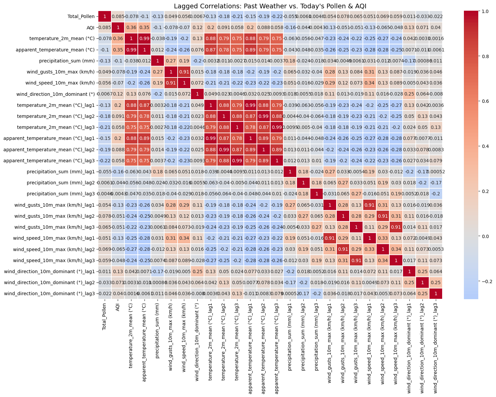

And once again filtered for stronger relationships, this time only considering those with total pollen or AQI as one of the variables.

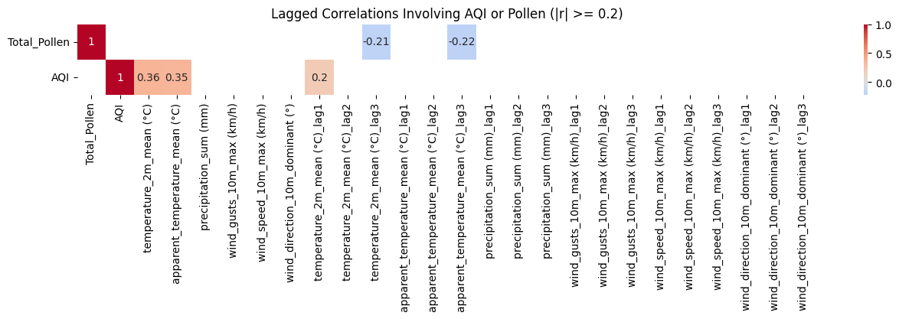

Despite these transformations, no major linear trends emerged, suggesting that nonlinear or clustered patterns may be more informative.
This motivated our next step — unsupervised clustering to uncover hidden relationships.
  

---
## Clusters

### Small Number of Clusters
When observing with small amounts of clusters, we didn't necessarily seem to get a lot of useful information -- there was a lot of overlap between clusters, and it was difficult to decipher any patterns. 

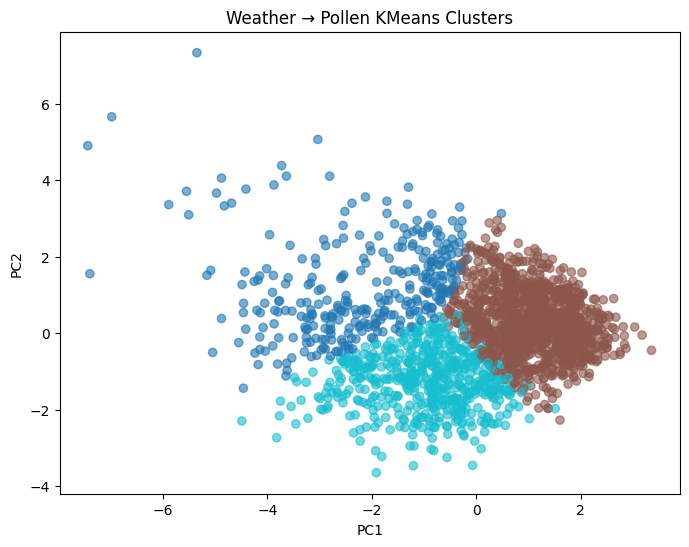

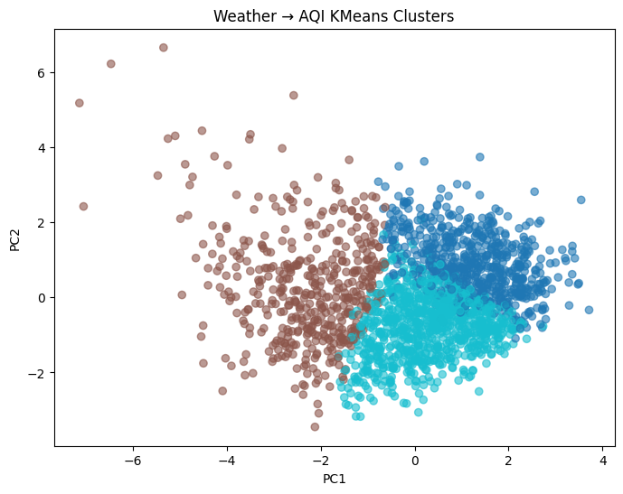

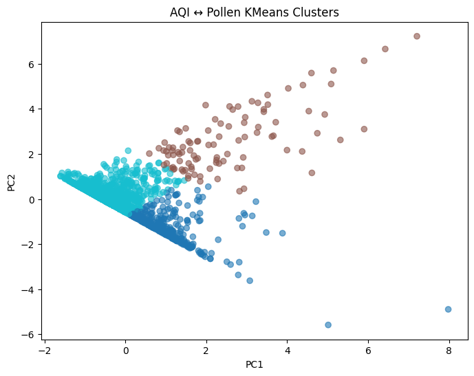

### "Optimal" number of clusters
Using the elbow method, we calculated the optimal number of clusters-- 17 for Weather to Pollen, 14 for Weather to AQI, and 11 for AQI to Pollen. These resulted in more interesting (and seemingly more useful) results.

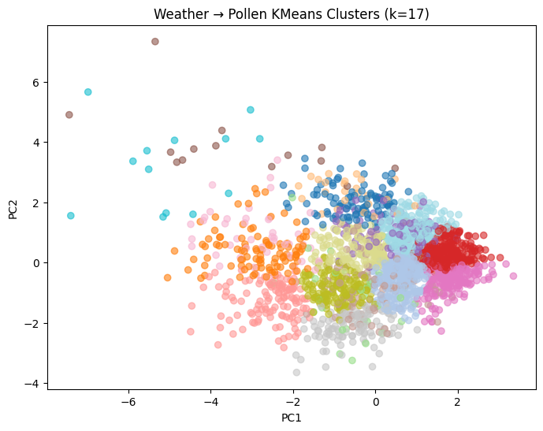

Although 17 clusters were generated, they broadly fell into **three main distinct categories** with several intermediary categories:

| Group | Typical Conditions | Mean Temp (°C) | Mean Precip (mm) | Wind Speed (km/h) | Mean Pollen | Description |
|:------|:------------------|:---------------:|:----------------:|:----------------:|:-------------:|:-------------|
| **A** | Cool, dry, early-spring days | 10–14 | <2 | 15–25 | **High (250–500)** | Peak pollen spikes |
| **B** | Warm, humid, post-rain periods | 18–25 | 5–12 | 10–20 | **Low (50–150)** | Pollen suppressed by rainfall |
| **C** | Transitional weather (mild temp, low rain) | 14–18 | 0–4 | 20–30 | **Moderate (150–300)** | Typical baseline conditions |

**Takeaway:**  
Even with fine-grained clustering, pollen levels were primarily driven by **temperature and precipitation**.  
Cool, dry conditions produced the **highest pollen counts**, while **rain and humidity** consistently reduced them.

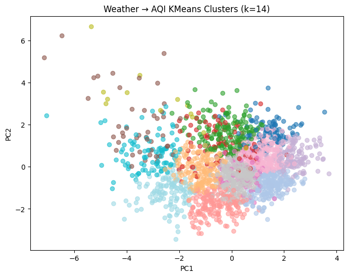

We applied **KMeans++ clustering (k=14)** to weather variables (temperature, precipitation, wind speed, humidity) and daily **Air Quality Index (AQI)** values.  
This finer clustering helped reveal distinct meteorological conditions that influence air quality levels in Boston.

Although 14 clusters were generated, they generally grouped into **three broader categories**:

| Group | Typical Conditions | Mean Temp (°C) | Mean Precip (mm) | Wind Speed (km/h) | Mean AQI | Description |
|:------|:------------------|:---------------:|:----------------:|:----------------:|:-----------:|:-------------|
| **A** | **Hot, dry, stagnant air** | 22–27 | <2 | 10–20 | **High (45–55)** | Elevated AQI, typical of summer heat events |
| **B** | **Cool, rainy, windy days** | 8–14 | 6–10 | 20–30 | **Low (25–35)** | Cleaner air due to dispersion and wet deposition |
| **C** | **Mild, dry transition periods** | 15–20 | 1–4 | 15–25 | **Moderate (35–45)** | Average air quality during typical spring/fall days |

**Takeaway:**  
Even with higher granularity (k=14), the patterns were clear:
- **AQI rises during hot, stagnant, and dry conditions**, when pollutants accumulate near the surface.  
- **Rain and higher wind speeds help clear the air**, lowering AQI values.  
- Transitional days with moderate weather yield mid-range AQI values.

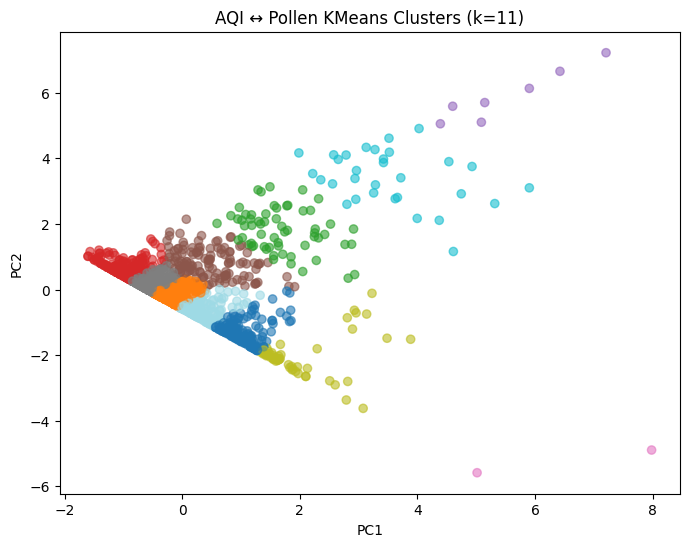

We clustered **AQI values** against **total pollen counts** using **KMeans++ (k=11)** to investigate how air quality relates to pollen levels.

The 11 clusters revealed **distinct patterns** between pollen load and air quality:

| Cluster Group | Typical AQI | Total Pollen | Description |
|:--------------|:-----------:|:------------:|:------------|
| **Low AQI, Low Pollen** | 25–35 | 10–50 | Clean air, early spring or wet days |
| **Low AQI, Moderate Pollen** | 25–35 | 50–150 | Mild days with moderate tree/grass pollen |
| **Moderate AQI, Moderate Pollen** | 36–45 | 100–250 | Typical spring/fall conditions |
| **Moderate AQI, High Pollen** | 36–45 | 250–500 | Elevated pollen during average air quality days |
| **High AQI, High Pollen** | 46–55 | 300–600 | Poor air quality with pollen accumulation |
| **High AQI, Very High Pollen** | 46–55 | 600–800+ | Extreme pollen events combined with poor AQI |

**Key Insights:**  
- **High AQI often coincides with high pollen counts**, suggesting days with stagnant air trap both pollutants and pollen.  
- **Low AQI clusters** correspond to either clean air with low pollen or mild days with moderate pollen, showing how weather dispersal effects influence both factors.  
- The clustering helps identify **pollution-pollen “risk days”** for sensitive populations.
This motivated our next step — unsupervised clustering to uncover hidden relationships.
  

---

## Clusters With Dates
These new clustering, including day and date, also highlights **temporal trends**:

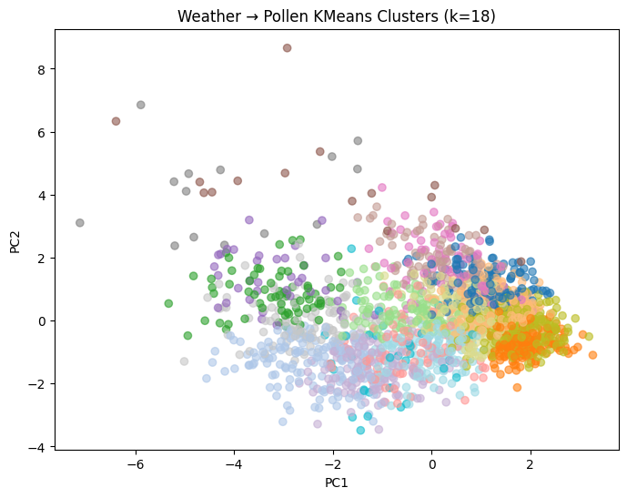

- **Weather → Pollen clusters:**  
  - High pollen clusters (e.g., clusters 4, 6, 7, 16, 17) predominantly occur in **spring (April–May)**.  
  - Low pollen clusters often correspond to **winter (March) or rainy periods**.  
  - Month and day data help pinpoint typical pollen peak windows.

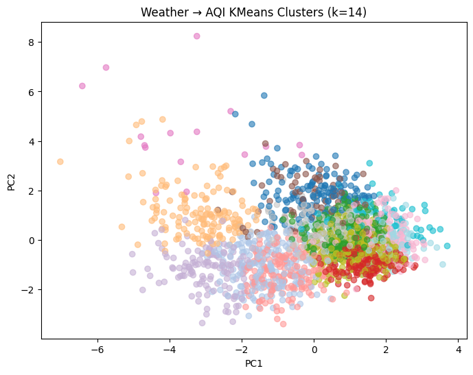

- **Weather → AQI clusters:**  
  - High AQI clusters appear mostly in **summer (June–July)**, aligning with hot, dry days.  
  - Low AQI clusters often occur during **cooler or rainy months**.

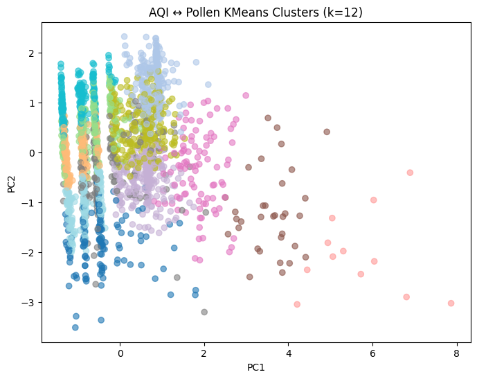

- **AQI ↔ Pollen clusters:**  
  - Extreme pollen spikes combined with moderate AQI are concentrated in **late spring**.  
  - Late summer shows low pollen and low AQI, indicating cleaner air and fewer allergens.  

Including the **month/day information** from clusters helps identify **seasonal trends** that are not captured by simple linear correlations.

### Cluster Conclusions 
While our earlier **correlation analyses** did not reveal strong linear relationships between **weather, AQI, and pollen**, the **clustering analyses** paint a different picture. 

The clusters suggest that there **are relationships between these variables**, but they are **non-linear** in nature. For example:  

- Certain ranges of **AQI coincide with specific pollen levels**, even if the overall Pearson correlation is weak.  
- Weather patterns seem to influence both **AQI and pollen**, but in complex, multi-dimensional ways that simple linear correlation cannot capture.  

#### Next Steps
To model these **non-linear relationships**, we plan to use:

- **Random Forests:** To capture complex interactions and non-linearities in the data.  
- **XGBoost:** For gradient-boosted decision trees that can further improve prediction accuracy on these patterns.  

These methods should allow us to **predict pollen levels from weather and AQI**, and vice versa, while accounting for the subtle, non-linear dependencies suggested by our clustering results.

