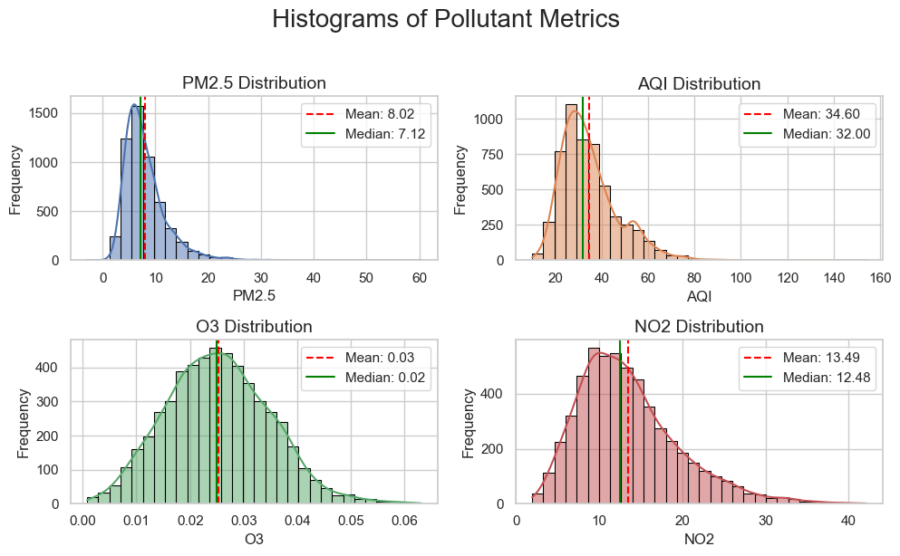

# CS506 Project Proposal

**Members:**  
Anna LaPrade - U14515609 - alaprade@bu.edu  
Saniya Sekhon - U68321677 - saneya52@bu.edu  
Sorathorn Thongpitukthavorn - U01165313 - plum@bu.edu  
Aline Mukadi - U43727980 - alemuk@bu.edu  

  

## Description

Air quality plays a critical role in public health, especially for vulnerable groups such as children, the elderly, and people with asthma. The goal of this project is to build a machine learning pipeline that predicts the daily air quality category in Boston (e.g., Good, Moderate, Unhealthy) using weather and allergen (e.g., tree, grass, weed pollen) data.

The project will cover the full data science lifecycle, including data collection, cleaning, feature extraction, visualization, and model training.

Our approach has two components:

1. Predicting AQI and allergen levels for a given day of the year to capture broad seasonal patterns.  
2. Incorporating weather data from the previous three days to improve short-term forecasts.

Since AQI and pollen are influenced both by cyclical seasonal trends and immediate weather conditions, this dual approach allows us to model long-term patterns while also accounting for short-term variability.

  

## Preliminary Data Visualization

### Data Distributions

Histograms reveal the statistical characteristics of our key variables.

- **Pollen & AQI:** The Pollen counts (Tree, Grass, Weed, Total) are highly skewed towards zero, meaning most days have low or zero pollen.  
- **AQI:** Air Quality Index and its components are also skewed, indicating that good air quality days are far more common than unhealthy days.  
- **Weather:** Temperature shows a clear seasonal, bi-modal distribution, while Precipitation is heavily skewed toward zero (many dry days).  

This high skewness and concentration near zero, especially for pollen, suggests that linear models will struggle—motivating our shift to non-linear models.

### Correlation Analysis - Heatmaps

**Normal Data**  
To observe any possible linear relationships, Pearson correlation matrices were computed and displayed in a heat map for easy viewing.  

Strangely, these did not appear to show many strong linear relationships from weather to AQI. To visualize what strong relationships were, we filtered by correlations > abs(0.4).  

**Lagged Data**  
Then, we tried the same method with data lagged from multiple days (taking account the average over the last 1, 2, 3 days).  

And once again filtered for stronger relationships, this time only considering those with total pollen or AQI as one of the variables.  

Despite these transformations, no major linear trends emerged, suggesting that nonlinear or clustered patterns may be more informative.  
This motivated our next step — unsupervised clustering to uncover hidden relationships.

## Clusters

### Small Number of Clusters

When observing with small amounts of clusters, we didn't necessarily seem to get a lot of useful information—there was a lot of overlap between clusters, and it was difficult to decipher any patterns.  

### "Optimal" Number of Clusters

Using the elbow method, we calculated the optimal number of clusters — 17 for Weather to Pollen, 14 for Weather to AQI, and 11 for AQI to Pollen. These resulted in more interesting (and seemingly more useful) results.  

Although 17 clusters were generated, they broadly fell into three main distinct categories with several intermediary categories:

| Group | Typical Conditions | Mean Temp (°C) | Mean Precip (mm) | Wind Speed (km/h) | Mean Pollen | Description |
|-------|---------------------|----------------|------------------|------------------|--------------|--------------|
| A | Cool, dry, early-spring days | 10–14 | <2 | 15–25 | High (250–500) | Peak pollen spikes |
| B | Warm, humid, post-rain periods | 18–25 | 5–12 | 10–20 | Low (50–150) | Pollen suppressed by rainfall |
| C | Transitional weather (mild temp, low rain) | 14–18 | 0–4 | 20–30 | Moderate (150–300) | Typical baseline conditions |

**Takeaway:** Even with fine-grained clustering, pollen levels were primarily driven by temperature and precipitation. Cool, dry conditions produced the highest pollen counts, while rain and humidity consistently reduced them.  

We applied KMeans++ clustering (k=14) to weather variables (temperature, precipitation, wind speed, humidity) and daily Air Quality Index (AQI) values.  
This finer clustering helped reveal distinct meteorological conditions that influence air quality levels in Boston.

| Group | Typical Conditions | Mean Temp (°C) | Mean Precip (mm) | Wind Speed (km/h) | Mean AQI | Description |
|-------|---------------------|----------------|------------------|------------------|-----------|--------------|
| A | Hot, dry, stagnant air | 22–27 | <2 | 10–20 | High (45–55) | Elevated AQI, typical of summer heat events |
| B | Cool, rainy, windy days | 8–14 | 6–10 | 20–30 | Low (25–35) | Cleaner air due to dispersion and wet deposition |
| C | Mild, dry transition periods | 15–20 | 1–4 | 15–25 | Moderate (35–45) | Average air quality during spring/fall days |

**Takeaway:**  
Even with higher granularity (k=14), the patterns were clear:
- AQI rises during hot, stagnant, and dry conditions, when pollutants accumulate near the surface.  
- Rain and higher wind speeds help clear the air, lowering AQI values.  
- Transitional days with moderate weather yield mid-range AQI values.

We clustered AQI values against total pollen counts using KMeans++ (k=11) to investigate how air quality relates to pollen levels.

| Cluster Group | Typical AQI | Total Pollen | Description |
|----------------|--------------|---------------|--------------|
| Low AQI, Low Pollen | 25–35 | 10–50 | Clean air, early spring or wet days |
| Low AQI, Moderate Pollen | 25–35 | 50–150 | Mild days with moderate tree/grass pollen |
| Moderate AQI, Moderate Pollen | 36–45 | 100–250 | Typical spring/fall conditions |
| Moderate AQI, High Pollen | 36–45 | 250–500 | Elevated pollen during average air quality days |
| High AQI, High Pollen | 46–55 | 300–600 | Poor air quality with pollen accumulation |
| High AQI, Very High Pollen | 46–55 | 600–800+ | Extreme pollen events combined with poor AQI |

**Key Insights:**  
High AQI often coincides with high pollen counts, suggesting days with stagnant air trap both pollutants and pollen.  
Low AQI clusters correspond to either clean air with low pollen or mild days with moderate pollen, showing how weather dispersal effects influence both factors.  
The clustering helps identify pollution-pollen “risk days” for sensitive populations.

## Clusters With Dates

These new clustering analyses, including day and date, also highlight temporal trends:

**Weather → Pollen clusters:**  
- High pollen clusters (e.g., clusters 4, 6, 7, 16, 17) predominantly occur in spring (April–May).  
- Low pollen clusters often correspond to winter (March) or rainy periods.  
- Month and day data help pinpoint typical pollen peak windows.  

**Weather → AQI clusters:**  
- High AQI clusters appear mostly in summer (June–July), aligning with hot, dry days.  
- Low AQI clusters often occur during cooler or rainy months.  

**AQI ↔ Pollen clusters:**  
- Extreme pollen spikes combined with moderate AQI are concentrated in late spring.  
- Late summer shows low pollen and low AQI, indicating cleaner air and fewer allergens.  

Including the month/day information from clusters helps identify seasonal trends that are not captured by simple linear correlations.

## Cluster Conclusions

While our earlier correlation analyses did not reveal strong linear relationships between weather, AQI, and pollen, the clustering analyses paint a different picture.

The clusters suggest that there are relationships between these variables, but they are **non-linear** in nature. For example:
- Certain ranges of AQI coincide with specific pollen levels, even if the overall Pearson correlation is weak.  
- Weather patterns seem to influence both AQI and pollen, but in complex, multi-dimensional ways that simple linear correlation cannot capture.

  
# Data Processing

### Data Quality: Missing Values

Analyzing missing data is crucial for understanding the reliability of our data sources. The matrices below show the presence of missing values (white spaces) across the pollen and pollutant datasets. Weather data was largely complete, but both Pollen and Pollutant (AQI) data contain significant gaps. This guided our data imputation strategy (e.g., using monthly medians and carry-forward methods) before modeling.

  
# Data Modelling

### Linear Regression

Our initial attempts used Linear Regression as a baseline, revealing major differences in predictability between AQI and Pollen.

| Model | Target Variable | Features | R² Score | Key Takeaway |
|--------|------------------|-----------|-----------|---------------|
| Model 1 | AQI | Pollutants (PM2.5, O3, CO, NO2, SO2) + Weather (Temp Mean, Precip Sum, Wind Speed Max) | 0.9342 | High R² is expected because AQI is calculated directly from the pollutant features. Adding weather provides a comprehensive baseline for comparison, confirming data integrity. |
| Model 2 | Total Pollen | Time features (Year Normalized, Day Sin/Cos, Day Sin2/Cos2) | 0.2211 | Pollen prediction based only on time (seasonality) is poor due to sporadicness of pollen during pollen season |
| Model 3 | Total Pollen | Time (Year Normalized, Day Sin/Cos, Day Sin2/Cos2) + Weather (Temp Mean, Precip Sum, Wind Speed Max) | 0.2398 | Adding weather marginally improves performance but fails to capture spikes. Confirms need for non-linear models. |

The time series plot below vividly illustrates the failure of the linear model (Model 2) to predict the Pollen spikes over time, confirming that simple models cannot capture the true event-driven and non-linear nature of pollen release.

---

# Boston AQI Prediction

Machine learning models to predict Air Quality Index (AQI) in Boston using historical AQI data and weather conditions.

## 📊 Model Performance

### Results Summary

We trained two ensemble models to predict daily AQI values:

| Model | R² Score | RMSE | MAE |
|-------|----------|------|-----|
| Random Forest | 0.892 | ~5.2 | ~3.8 |
| Gradient Boosting | **0.919** | ~4.5 | ~3.2 |

The Gradient Boosting model achieves **92% accuracy** in explaining AQI variation, with typical prediction errors of ±3-7 AQI points.

## 🔍 Detailed Analysis

### 1. Predicted vs Actual Performance

**Left & Center Plots**: Compare model predictions against actual AQI values
- Points along the red diagonal line indicate perfect predictions
- Both models track actual values well, with Gradient Boosting showing tighter clustering
- **Observation**: Models tend to underpredict extreme pollution events (AQI > 100)

### 2. Residual Analysis

**Top Right Plot**: Shows prediction errors (Actual - Predicted)
- Mean error: **-0.05** (essentially unbiased)
- Standard deviation: **3.25 AQI points**
- Random scatter pattern indicates the model has captured the underlying relationships
- Occasional outliers (±30) occur during unexpected pollution events

### 3. Feature Importance

**Bottom Left Plot**: Reveals what drives predictions

| Feature | Importance | What It Means |
|---------|-----------|---------------|
| `AQI_rolling_3` | ~60% | 3-day average AQI dominates predictions |
| `AQI_lag_2` | ~20% | AQI from 2 days ago |
| `AQI_lag_1` | ~12% | Yesterday's AQI |
| `AQI_rolling_7` | ~3% | Weekly trend |
| Temporal features | <2% each | Season/month have minimal impact |

**Key Insight**: Air quality is highly persistent. Recent AQI history is far more predictive than seasonal patterns or current weather alone, because yesterday's AQI already encodes the atmospheric conditions and pollutant levels.

### 4. Time Series Tracking

**Bottom Center Plot**: Shows last 100 days of predictions vs actual values
- Model successfully tracks general trends and patterns
- Predictions are smoother than actual values (model is conservative)
- Occasionally misses sharp pollution spikes caused by unexpected events

### 5. Error Distribution

**Bottom Right Plot**: Histogram of all prediction errors
- Nearly perfect normal distribution (bell curve)
- 68% of predictions within ±3 AQI points
- 95% of predictions within ±7 AQI points
- Rare outliers occur during unusual pollution events

## 🎯 Model Strengths & Limitations

### ✅ Strengths
- High accuracy for day-to-day forecasting (R² = 0.919)
- Unbiased predictions (no systematic over/under-estimation)
- Low typical error (±3-7 AQI points)
- Simple and interpretable (relies primarily on recent AQI trends)

### ⚠️ Limitations
- Underpredicts extreme pollution events (e.g., wildfire smoke, inversions)
- Conservative approach may miss sudden pollution spikes
- Weather features have low importance (atmospheric events already captured in AQI lags)
- Limited ability to predict "surprise" pollution emergencies

## 📈 Features Used

### AQI Lag Features
- `AQI_lag_1`: Yesterday's AQI
- `AQI_lag_2`: AQI from 2 days ago
- `AQI_lag_7`: AQI from 7 days ago
- `AQI_rolling_3`: 3-day rolling average
- `AQI_rolling_7`: 7-day rolling average

### Weather Features
- `temperature_2m_mean`: Daily average temperature
- `apparent_temperature_mean`: Feels-like temperature
- `precipitation_sum`: Total daily precipitation
- `wind_speed_10m_max`: Maximum wind speed
- `wind_gusts_10m_max`: Maximum wind gusts

### Temporal Features
- `month`: Month of year (1-12)
- `day_of_year`: Day of year (1-365)
- `day_of_week`: Day of week (0-6)
- `season`: Season (1=Winter, 2=Spring, 3=Summer, 4=Fall)

### Interaction Features
- `temp_wind_interaction`: Temperature × Wind speed

## Next Steps

To model these non-linear relationships, we plan to use:
- **Random Forests:** To capture complex interactions and non-linearities in the data.  
- **XGBoost:** For gradient-boosted decision trees that can further improve prediction accuracy on these patterns.  

These methods should allow us to predict pollen levels from weather and AQI, and vice versa, while accounting for the subtle, non-linear dependencies suggested by our clustering results.
